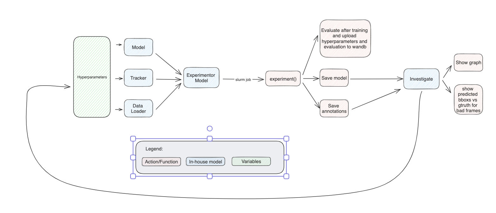

# Model Experimentation
This notebook is designed to streamline experimentation with different models.

The workflow summarised above consists in:
1. Selecting a model, dataset, tracker and hyperparameters
2. Training the model and evaluating both object detection and tracking performance
3. Saving the results in wandb
4. Storing the model and evaluation annotations in a folder
5. **Investigation** of the results, detection of failure cases and model improvement
6. **Iterating** over steps 1-5

